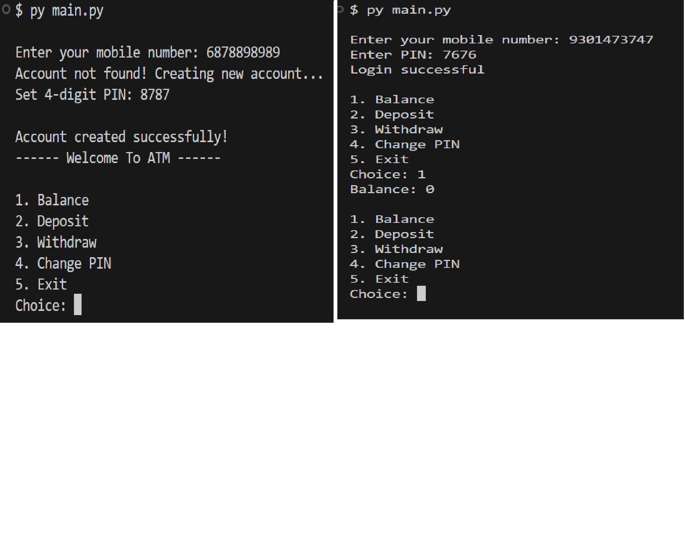

# 🏧 ATM Management System (Python + MySQL)

This is a simple ATM simulation project built using Python and MySQL (PyMySQL). It allows users to create accounts, login, and perform basic banking operations.

---

## 🚀 Features
- User Login (Mobile Number + PIN)
- Auto Account Creation (if user not exists)
- Check Balance
- Deposit Money
- Withdraw Money
- Change PIN
- PIN Validation (4-digit & unique)
- Mobile Number Validation (10 digits, starts with 6/7/8/9)
- Data stored in MySQL database

---

## 📁 Project Structure
ATM_Project/
│
├── main.py        # Entry point  
├── atm.py         # Main ATM logic  
├── db.py          # Database connection  
├── config.py      # Database configuration  
└── README.md      # Documentation  

---

## ⚙️ Setup Instructions

1. Install dependencies:
pip install pymysql cryptography

2. Setup MySQL Database:
CREATE DATABASE atm_db;
USE atm_db;
CREATE TABLE users (
    account_number VARCHAR(10) PRIMARY KEY,
    pin VARCHAR(4) UNIQUE,
    balance INT
);

3. Configure Database (config.py):
DB_CONFIG = {
    "host": "localhost",
    "user": "root",
    "password": "your_password",
    "database": "atm_db"
}

4. Run Project:
python main.py

---

## 🧠 How It Works
- User enters mobile number  
- If account exists → login with PIN  
- If not → account is created automatically  
- After login → user gets ATM menu  

---

## 🔐 Validations
- Mobile number: 10 digits, starts with 6/7/8/9  
- PIN: 4 digits, unique  

---

## ⭐ Note
This is a beginner-friendly project for learning Python OOP, MySQL integration, and basic banking logic.

## Author

Sandeep Aanjana

